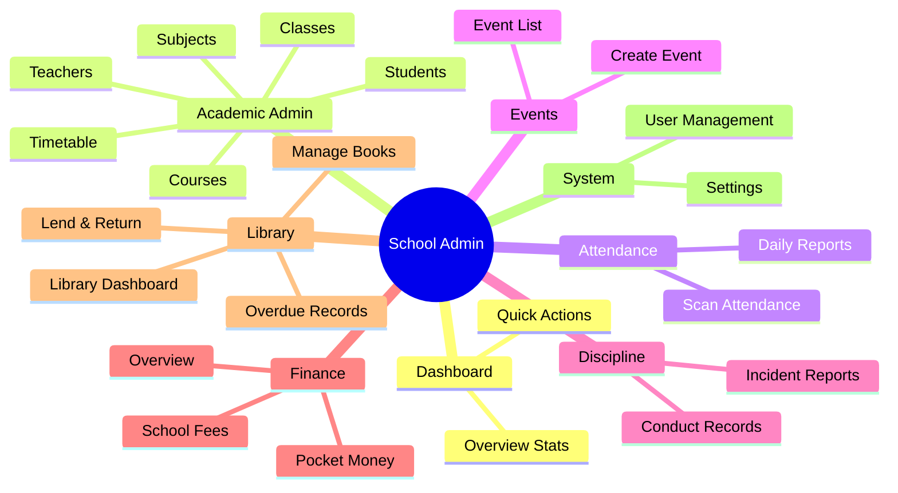

# School Admin Portal Features & Architecture

This document maps out the current and proposed features for the **School Admin Portal**, including your requested expansions for the Library and other modules. Review the diagram and list below to decide our next steps.

## User Review Required

> [!NOTE]
> Please review the expanded **Library** section and the overall structure. Let me know if you want to add, remove, or modify any sub-links before we start implementing them!

## Architecture Diagram

## Detailed Feature List

### 1. Dashboard
- **Overview Stats**: Quick metrics for total students, revenue, attendance rates.
- **Quick Actions**: Shortcuts to frequently used actions (e.g., scan attendance, new event).

### 2. Academic Admin
- **Classes**: Manage class streams (e.g., S1A, S2B) and their capacities.
- **Subjects**: Define subjects and curriculum.
- **Courses**: Manage course materials and holiday packages.
- **Timetable**: Auto-generate or manually edit class schedules.
- **Teachers**: Manage teacher profiles, subjects taught, and assignments.
- **Students**: Complete student directory and individual profiles.

### 3. Attendance
- **Scan Attendance**: Interface for quick scanning (QR/Barcodes) or manual entry.
- **Daily Reports**: View daily absentees and long-term attendance trends.

### 4. Events
- **Event List**: View all upcoming and past school events.
- **Create Event**: Schedule new events, set dates, and notify parents/students.

### 5. Discipline
- **Conduct Records**: Track student behavior points and overall conduct.
- **Incident Reports**: Log specific disciplinary actions and infractions.

### 6. Finance
- **Finance Overview**: Dashboard for total revenue, expenses, and fee collection progress.
- **School Fees**: Track individual student payments and pending balances.
- **Pocket Money**: Digital wallet management and top-ups for students.

### 7. Library (Expanded)
- **Library Dashboard**: Overview of total books, currently borrowed, and overdue items.
- **Manage Books (Add/Edit)**: Catalog new books, define genres, and track physical shelf locations.
- **Lend & Return Books**: Quick interface to scan/assign books to students or teachers and process returns.
- **Overdue Records**: Track late returns, issue reminders, and manage library fines.

### 8. System & Compliance
- **Settings**: School-wide configurations (academic years, terms, grading scales).
- **User Management**: Add, remove, or edit administrative staff and roles.
